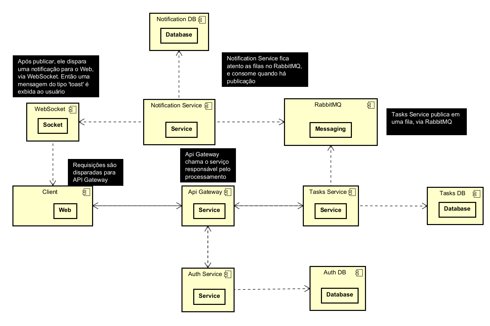

# 🏝️ Desafio JungleGaming

Este é o código fonte da solução para o desafio JungleGaming — uma arquitetura **monorepo em TypeScript** com microserviços em NestJS, comunicação via mensageria e suporte a várias features como autenticação, tasks, comentários e notificações em tempo real.

Melhorias serão continuadas na branch `updates`.

## 📁 Estrutura do Repositório

O projeto está organizado como um **monorepo** usando **pnpm workspaces** e **Turborepo**:

```
/
├─ apps/
├─ package.json
├─ pnpm-workspace.yaml
├─ turbo.json
├─ tsconfig.base.json
├─ .gitignore
```

Cada pasta dentro de `apps/` representa um microserviço ou aplicação isolada. ([GitHub][1])

---

## Arquitetura do Projeto



## 📌 Tecnologias Utilizadas

| Categoria                   | Ferramenta                 |
| --------------------------- | -------------------------- |
| Linguagem                   | TypeScript                 |
| Backend                     | NestJS                     |
| Microservices               | NestJS + TCP ou mensageria |
| Messaging                   | ClientProxy                |
| ORM                         | TypeORM com PostgreSQL     |
| Real-time                   | WebSocket Gateway          |
| Gerenciamento de Workspaces | pnpm                       |
| Monorepo Tooling            | Turborepo                  |
| Tokens de autenticação      | JWT                        |
| Logging                     | Pino                       |
| Validação                   | class-validator            |
| Swagger                     | Documentação de APIs       |

---

## 🚀 Pré-requisitos

Antes de rodar o projeto, instale:

* Node.js >= 18
* pnpm
* PostgreSQL rodando local ou remoto
* RabbitMQ

---

## 🧰 Instalação

Execute na raiz do projeto:

```bash
pnpm install
```

Isso vai instalar todas as dependências e resolver workspaces.

---

## 🧠 Variáveis de Ambiente

Crie um arquivo `.env` na raiz da aplicação com as variáveis necessárias:

```env
# Auth service
JWT_SECRET=SECRET_KEY
REFRESH_SECRET_KEY=REFRESH_SECRET_KEY

# API gateway
API_GATEWAY_PORT=3000
FRONTEND_ORIGIN=http://localhost:5173

# Auth microservice
AUTH_PORT=3001
AUTH_HOST=localhost

# Tasks microservice
TASKS_PORT=3002
TASKS_HOST=localhost

# Notifications microservice
NOTIFICATION_PORT=3004

# Database
DB_HOST=localhost
DB_PORT=5432
DB_USERNAME=postgres
DB_PASSWORD=1234
DB_NAME=your_db_name
```

A configuração pode variar por escopo (cada serviço pode ter seu próprio `.env`). — Certifique-se de que todos os serviços leiam as variáveis antes de inicializar.


## 📦 Scripts Disponíveis

Rodando na raiz:

```bash
pnpm dev
```

ou

```bash
pnpm turbo run dev
```

O Turborepo executa os serviços conforme configuração no `turbo.json` (geralmente em paralelo com watch). ([GitHub][1])


## 🧩 Microserviços

### 🛡️ Auth

* Endpoints: `/auth/login`, `/auth/register`, `/auth/refresh`, `/auth/logout`, `/auth/profile`
* Comunicação via microservices (TCP ou mensagens)
* Tokens JWT com refresh

### 🧠 Tasks

* CRUD completo de tarefas
* Filtros por prioridade, status e título
* Histórico de alterações
* Notificações emitidas para outros serviços

### 💬 Comments

* Owner acrescenta comentários à tarefa
* Mensageria comunica alterações para notificações

### 🔔 Notifications

* Escuta eventos como `tasks.created`, `tasks.updated`, `comment.new`
* Persiste notificações no banco
* Envia eventos via WebSocket para os clientes conectados


## 📄 Documentação de API

Swagger está configurado no API Gateway:

```bash
GET http://localhost:3000/api/docs
```

Ele expõe todos os endpoints disponíveis com exemplos. Isso inclui payloads e respostas de cada rota.


## 🌐 WebSockets

Notifications usam **WebSockets** e permitem client connections autenticadas:

```
ws://localhost:PORT/ws?email=usuario@example.com
```

Clientes recebem eventos em tempo real conforme notificações são geradas.


## Decisões técnicas

### Porque utilizar `pnpm`?
Por que utilizar pnpm em vez de npm neste projeto?

Este projeto adota pnpm como gerenciador de pacotes por se tratar de um monorepo com múltiplos microserviços NestJS, compartilhando código, dependências e padrões arquiteturais.

A escolha é baseada em desempenho, consistência, economia de espaço e segurança arquitetural.

Entre outros motivos, o principal é:
*Cada serviço usa NestJS compartilha DTOs, enums, utils depende de versões compatíveis das mesmas libs. O npm duplica dependências em cada node_modules, cresce rapidamente o tamanho do projeto e deixa o install lento e pesado, além disso ele permite dependências “fantasmas” (imports que não existem no package.json).*

### Porque utilizar `pino`?
Entre outros motivos:

1) Baixa latência e baixo uso de CPU: O Pino tem um foco claro em garantir que o logging não afete a performance do sistema. Ele usa:
- Streams assíncronos para reduzir o tempo de bloqueio;
- Buffers internos para reduzir a sobrecarga de escrita no disco ou na rede.

Isso significa que em ambientes de alta concorrência, como sistemas distribuídos ou com alto tráfego, o Pino não impacta o desempenho como outras bibliotecas de logging podem fazer.

2) Integração fácil com NestJS: Pino integra-se perfeitamente ao NestJS. Em Nest, você pode facilmente criar um logger personalizado utilizando o nestjs-pino, um pacote que integra o Pino com a infraestrutura de logging do NestJS.

### Porque utilizar `QueryBuilder`?
1. find() é bom para casos simples. repository.find() funciona bem quando:

- Filtros são estáticos
- Não há combinações dinâmicas
- Não há paginação complexa
- Não há joins condicionais

Em nosso cenário, temos tudo isso ao mesmo tempo:

Filtros opcionais:
- title
- priority
- status
- Paginação
- Ordenação
- Join com comentários

O que nos faz optarmos por QueryBuilder.

2. Filtros dinâmicos (condicionais)

```javascript
if (title) {
  qb.andWhere('LOWER(task.title) LIKE LOWER(:title)', {
    title: `%${title}%`,
  });
}

if (priority) {
  qb.andWhere('task.priority = :priority', { priority });
}

if (status) {
  qb.andWhere('task.status = :status', { status });
}
```

Por que QueryBuilder é a escolha certa aqui:

Com find() teriamos:
- Um objeto where gigante
- Condições espalhadas
- Código difícil de manter

Com QueryBuilder:

- Cada filtro é opt-in
- Código é legível
- Fácil adicionar novos filtros no futuro

## Tempo de desenvolvimento
Dia 1: Entendendo conceitos teóricos do projeto
Dia 2: Configurando ambiente + implementação do Api Gateway
Dia 3: Implementação do Auth-Service
Dia 4: Conclusão do Auth-Service
Dia 5: Implementação do Tasks Service
Dia 6: Implementação do Notifications Service
Dia 7: Configuração + IMplementação do Web
Dia 8: Integração do Web + Api Gateway
Dia 9: Configuração do Web + Websocket
Dia 10 - 12: Configurando Websocket do Web + Websocket do Notifications Service
Dia 13: Documentando serviços 
Dia 14: Refatorando o código + Readme.md final

## 💡 Recomendações para Desenvolvimento

* Use **branches por feature** (ex: `feat/auth-jwt-refresh`)
* Faça **commits atômicos** — um objetivo por commit
* Atualize o branch `dev` antes de realizar pull requests
* Teste fluxos importantes com dados reais


## 🧩 Boas práticas de Git

* Trabalhe em branch isolada
* Faça PRs para `dev` antes de mesclar em `main`
* Mantenha a branch `dev` sempre estável


## 🤝 Contribuição

Se quiser contribuir:

1. Crie uma branch local nova baseada em `dev`
2. Faça commits claros e atômicos
3. Abra um pull request para a branch `dev` com descrição do que foi feito


## 📝 Contato

```
Leonardobern10 — https://github.com/Leonardobern10
```

